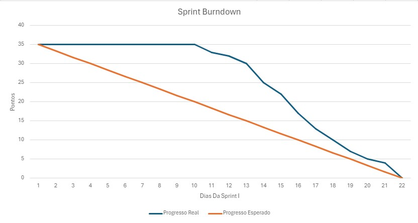
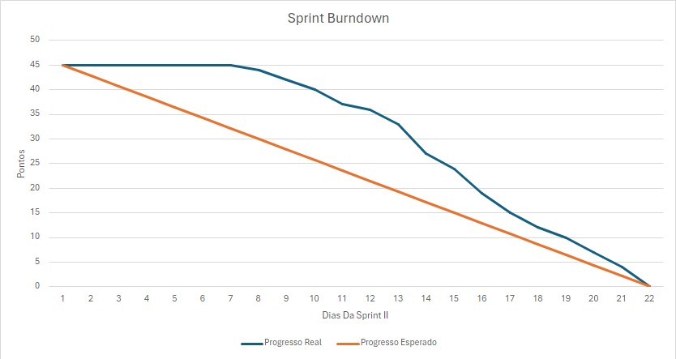
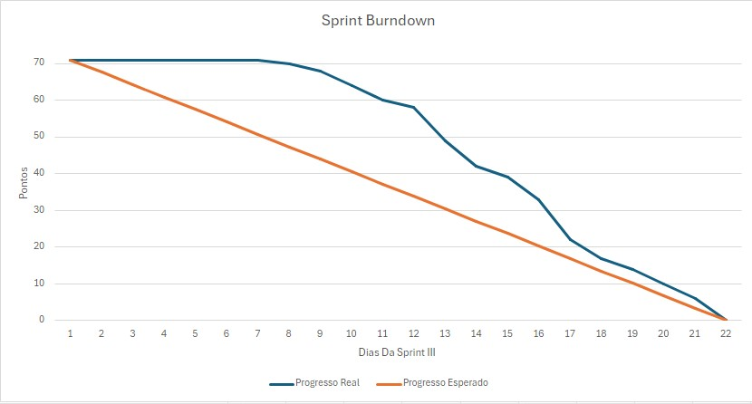
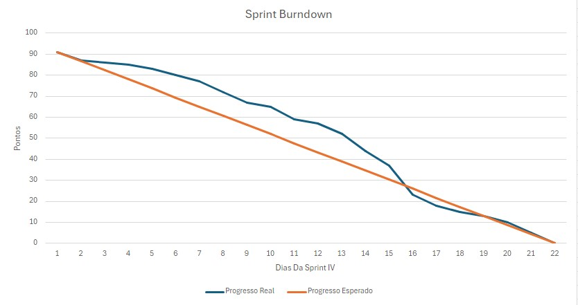

# API-4DSM-LW

 <a href="#sobre">Projeto</a> •
 <a href="#api">Sobre a API</a> • 
 <a href="#backlog">Product Backlog</a> • 
 <a href="#equipe">Equipe</a>

 <a href="#s1">Sprint 1</a> 
 <a href="#s2">Sprint 2</a> 
  <a href="#s3">Sprint 3</a> 
  <a href="#s4">Sprint 3</a> 

# Sobre o Projeto 

DESCRIÇÃO SOBRE O PROJETO

A problemática abordada neste projeto reside na necessidade de expansão do portfólio da empresa Tecsus para incluir o monitoramento ambiental, enquanto busca oferecer soluções de baixo custo e alta eficiência. A empresa enfrenta o desafio de desenvolver estações meteorológicas que possam coletar dados precisos sobre as condições ambientais relevantes, como direção e velocidade do vento, índice pluviométrico, umidade, temperatura e pressão, e transmiti-los de forma confiável para um servidor central. Além disso, há a necessidade de engajar os alunos do ensino médio por meio de uma abordagem educativa, demonstrando os conceitos matemáticos por trás dos cálculos dos parâmetros meteorológicos e destacando a importância do monitoramento ambiental na prevenção de desastres naturais.

A solução proposta envolve o desenvolvimento de estações meteorológicas de baixo custo, equipadas com os sensores necessários para coletar dados precisos sobre as condições ambientais. Esses dados serão transmitidos para um servidor central, onde serão recebidos, processados e exibidos em um portal online. Além de fornecer informações em tempo real sobre o clima local, o portal terá uma função educativa, explicando os conceitos matemáticos envolvidos nos cálculos dos parâmetros meteorológicos e destacando a importância do monitoramento ambiental na prevenção de desastres naturais. Ao disponibilizar dois kits de estação meteorológica para instalação em instituições de ensino, o projeto busca envolver os alunos do ensino médio na observação e compreensão do clima, promovendo assim a conscientização ambiental e científica.

# Sprints do Projeto 

### Sprint 1: 

Na primeira Sprint tivemos um foco intenso na criação da Arquitetura, modelagem do Banco de Dados, e a criação dos CRUDs de todas as tabelas contempladas pela modelagem de dados.

####  BackLog da Sprint 1:
| DESCRIÇÃO                                  | PRIORIZAÇÃO |
| ------------------------------------------ | ----------- |
| ARQUITETURA DO PROJETO                     | ALTA        |
| PROTOTIPAGEM / LAYOUT                      | ALTA        |
| ESTRUTURAÇÃO E MODELAGEM DO BANCO DE DADOS | ALTA        |
| CRUD DE USUÁRIOS                           | ALTA        |
| CRUD DE ESTAÇÕES                           | ALTA        |

#### BurnDown Sprint 1:

### Sprint 2: 

Na segunda Sprint fizemos os serviços de recepção de Dados, Tratamento e Armazenamento Juntamente com as Features de Emissão De Alertas e DashBoards. 

####  BackLog da Sprint 2:
| DESCRIÇÃO                                  | PRIORIZAÇÃO |
| ------------------------------------------ | ----------- |
| ATRIBUTOS DE ESTAÇÕES                      | MÉDIA       |
| TIPOS DE ESTAÇÕES                          | MÉDIA       |
| RECEBIMENTO E ARMAZENAMENTO DE DADOS       | MÉDIA       |
| CRIAÇÃO DE DASHBOARDS                      | MÉDIA       |

#### BurnDown Sprint 2:

### Sprint 3: 

Na terceira Sprint fizemos alguns ajustes como em alertas e DashBoards e realizamos a programação da placa enviar dados. 

####  BackLog da Sprint 3:
| DESCRIÇÃO                                  | PRIORIZAÇÃO |
| ------------------------------------------ | ----------- |
| MANDAR DADOS PELA PLACA                    | BAIXA       |

#### BurnDown Sprint 3:

### Sprint 4: 

Na terceira Sprint fizemos alguns ajustes como em alertas e DashBoards e realizamos a programação da placa enviar dados. 

####  BackLog da Sprint 4:
| DESCRIÇÃO                                   | PRIORIZAÇÃO |
| ------------------------------------------- | ----------- |
|  CRIAÇÃO DE RELATÓRIOS                      | BAIXA       |
|  ALERTAS PARA USUÁRIOS COMUNS               | BAIXA       |
|  GERAÇÃO DE RELATÓRIOS PARA USUÁRIOS        | BAIXA       |
|  SUPORTE AO USUÁRIO COMUM                   | BAIXA       |
|  TUTORIAL SOBRE PARÂMETROS METEOROLÓGICOS   | BAIXA       |

#### BurnDown Sprint 4:

# Product Backlog Total: 

| SPRINT | DESCRIÇÃO                                  | PRIORIZAÇÃO |
| ------ | ------------------------------------------ | ----------- |
| 1      | ARQUITETURA DO PROJETO                     | ALTA        |
| 1      | PROTOTIPAGEM / LAYOUT                      | ALTA        |
| 1      | ESTRUTURAÇÃO E MODELAGEM DO BANCO DE DADOS | ALTA        |
| 1      | CRUD DE USUÁRIOS                           | ALTA        |
| 1      | CRUD DE ESTAÇÕES                           | ALTA        |
| 1      | CRUD DE PARÂMETROS PARA ESTAÇÕES           | ALTA        |
| 2      | ATRIBUTOS DE ESTAÇÕES                      | MÉDIA       |
| 2      | TIPOS DE ESTAÇÕES                          | MÉDIA       |
| 2      | RECEBIMENTO E ARMAZENAMENTO DE DADOS       | MÉDIA       |
| 2      | CRIAÇÃO DE DASHBOARDS                      | MÉDIA       |
| 2      | EMISSÃO DE ALERTAS                         | BAIXA       |
| 2      | VISUALIZAÇÃO DE DADOS POR USUÁRIOS         | MÉDIA       |
| 2      | DESENVOLVIMENTO DE DATALOGGER              | MÉDIA       |
| 2      | APLICAÇÃO DE ESTATÍSTICAS AOS DASHBOARDS   | MÉDIA       |
| 3      | MANDAR DADOS PELA PLACA                    | BAIXA       |
| 4      | CRIAÇÃO DE RELATÓRIOS                      | BAIXA       |
| 4      | ALERTAS PARA USUÁRIOS COMUNS               | BAIXA       |
| 4      | GERAÇÃO DE RELATÓRIOS PARA USUÁRIOS        | BAIXA       |
| 4      | SUPORTE AO USUÁRIO COMUM                   | BAIXA       |
| 4      | TUTORIAL SOBRE PARÂMETROS METEOROLÓGICOS   | BAIXA       |

# :busts_in_silhouette: Equipe: 
|                                                                                                                                                           | Nome             | Github                              | Função        |
| --------------------------------------------------------------------------------------------------------------------------------------------------------- | ---------------- | ----------------------------------- | ------------- |
|        | Miguel Soares    | https://github.com/Miguel-C1        | Scrum Master  |
|           | Gabriel Briscese | https://github.com/zani19           | Product Owner |
|     | Caio Dias        | https://github.com/CaioVitorDias1   | Desenvolvedor |
|           | Gabriel Briscese | https://github.com/Briscese         | Desenvolvedor |
|    | Jonas Ribeiro    | https://github.com/jonasrsribeiro   | Desenvolvedor |
